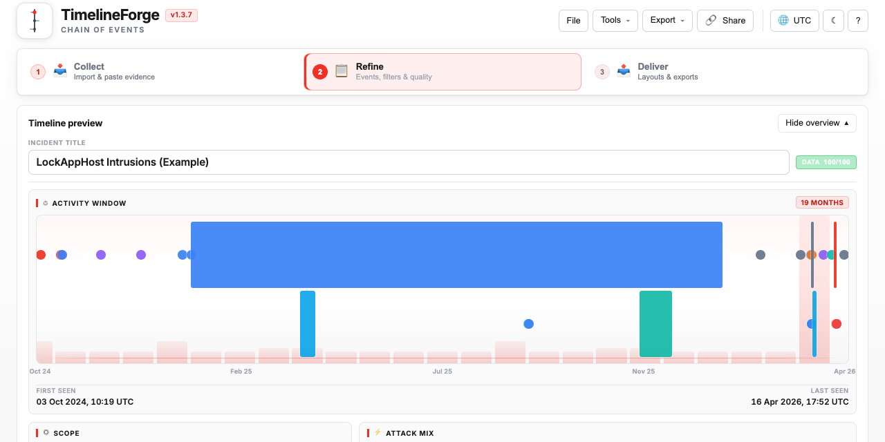
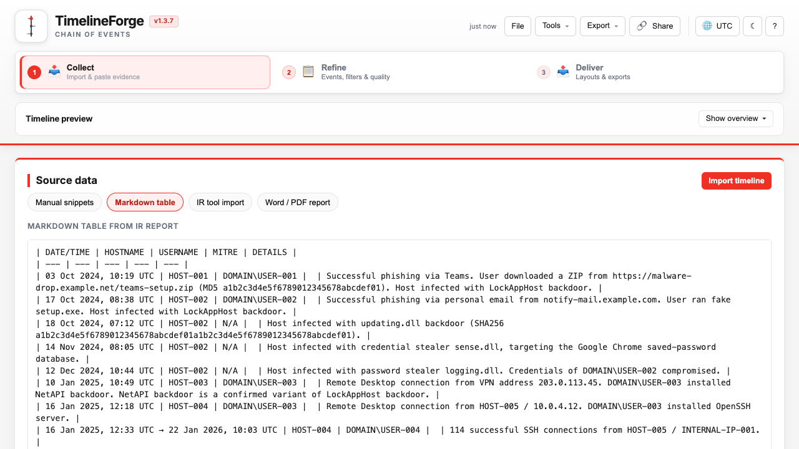
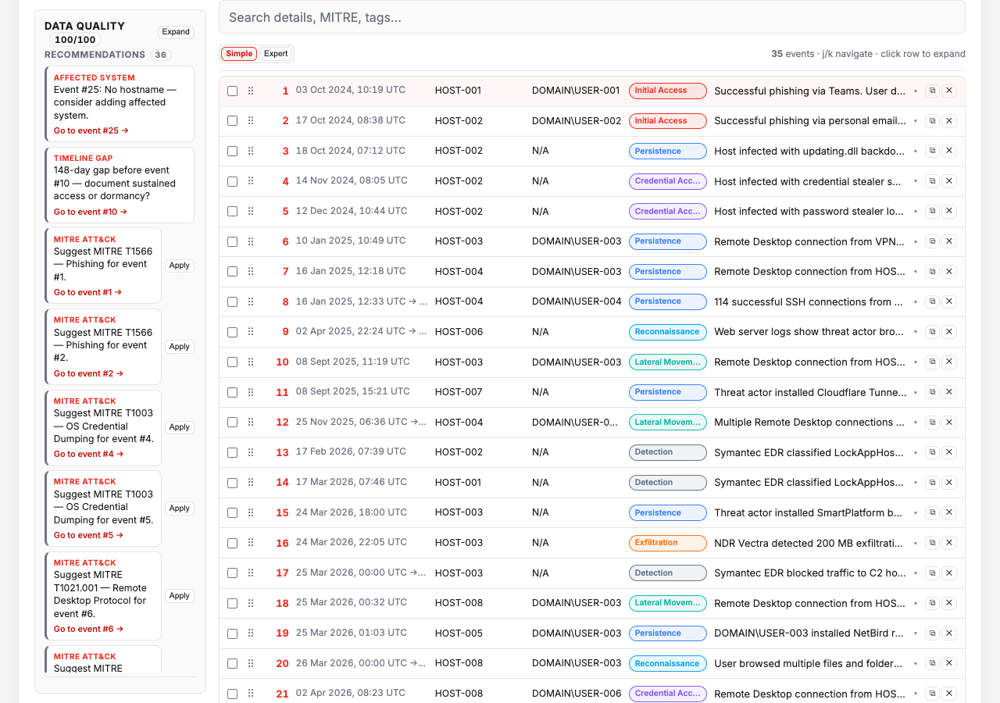
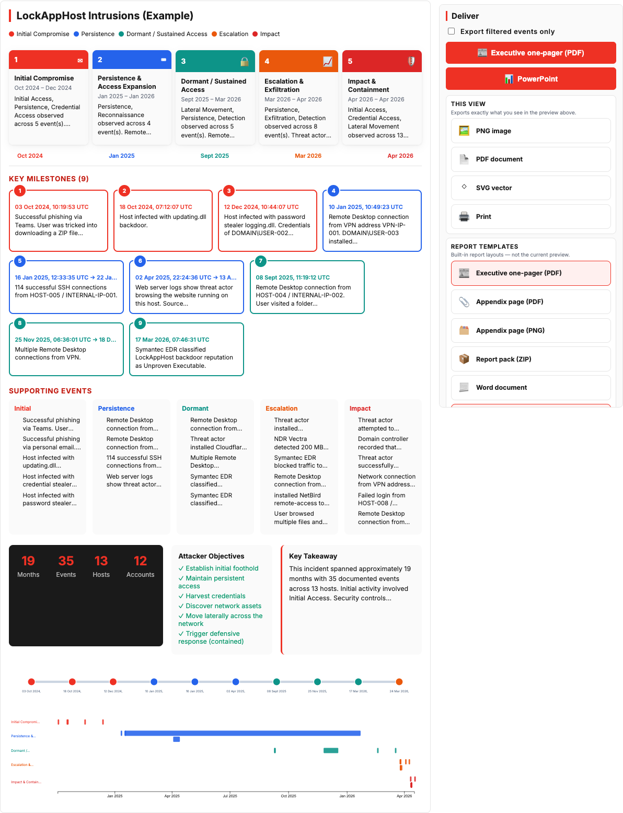

# TimelineForge

**Free, browser-based incident response timeline editor** for SOC analysts and IR leads. Import Splunk, Sentinel, KAPE, Hayabusa, and 20+ other DFIR exports; refine events with MITRE mapping and observables; export executive PDFs, PowerPoint briefings, STIX 2.1, and report appendices — **no server, no account, data stays in your browser.**

[](https://dmalcher-ftnt.github.io/timelineforge/)
[](LICENSE)
[](https://github.com/dmalcher-FTNT/timelineforge/actions/workflows/test.yml)

<p align="center">
  <a href="https://dmalcher-ftnt.github.io/timelineforge/"><strong>Open live demo →</strong></a>
</p>

## Contents

- [At a glance](#at-a-glance)
- [Who it’s for](#who-its-for)
- [Privacy & offline](#privacy--offline)
- [Workflow](#workflow)
- [Highlights](#highlights)
- [Quick start](#quick-start)
- [Screenshots](#screenshots)
- [Contact](#contact)

## At a glance

<p align="center">
  <a href="https://dmalcher-ftnt.github.io/timelineforge/">
    
  </a>
</p>

<p align="center"><sub>App shell — Collect · Refine · Deliver with timeline overview (APT breach sample)</sub></p>

Investigation timelines often live in spreadsheets, SIEM tabs, or slide decks that are painful to rebuild for leadership. TimelineForge follows one **Collect → Refine → Deliver** workflow in the browser.

## Who it’s for

- **SOC / IR analysts** — ingest tool exports and report appendices, filter by host, user, or MITRE technique
- **IR leads & consultants** — executive layouts (leadership board, swimlanes, milestone storyboard) with preview-before-download exports
- **Air-gapped or offline review** — PWA after first visit, or `npm run package` for a portable archive

## Privacy & offline

- **No backend** — timeline JSON never leaves the browser unless you export or share it
- **Shareable links** use deflate-compressed `#data=` URLs from your current site address (GitHub Pages, `localhost`, or any static host) — no server
- **Offline PWA** after first visit; drafts saved in browser storage

## Workflow

| Step | Purpose |
|------|---------|
| **Collect** | Manual snippets, markdown tables, JSON, PDF/DOCX, **23 IR tool parsers** |
| **Refine** | Filters, observables sidebar, data quality, baseline compare, anonymize |
| **Deliver** | **17 IR layouts**, live preview, PNG/PDF/PPTX/SVG and report exports |

<p align="center">
  
  &nbsp;
  
</p>

<p align="center">
  
</p>

<p align="center"><sub>Collect · Refine · Deliver — <a href="https://dmalcher-ftnt.github.io/timelineforge/">open live demo</a></sub></p>

## Highlights

- **23 IR parsers** — Splunk, Sentinel, Elastic, KAPE, Hayabusa, EvtxECmd, CrowdStrike, MISP, and more
- **Observables sidebar** — click IPs, domains, hashes, or URLs to filter events
- **17 deliver layouts** — swimlanes, MITRE heatmap, containment lanes, report appendix, evidence table, …
- **Unified exports** — preview before download for visuals and data formats; STIX 2.1, iCal, offline HTML
- **Fit-to-page PDF/PPTX** — wide swimlanes scale instead of clipping
- **Collapsible timeline overview** — activity window and scope stats when you need context
- **Keyboard** — ⌘/Ctrl+1/2/3 workspaces, undo/redo, `?` for help

Inspired by [MetroViz](https://github.com/rstockm/Metroviz), built for security incidents.

## Quick start

**Try the demo:** [dmalcher-ftnt.github.io/timelineforge](https://dmalcher-ftnt.github.io/timelineforge/) → **File → Samples** (APT breach, ransomware, BEC, insider threat, …)

**Run locally:**

```bash
git clone https://github.com/dmalcher-FTNT/timelineforge.git
cd timelineforge
npm install && npm run vendor   # first time — builds vendor/ (~30 MB, not in git)
python3 -m http.server 8080
```

Open **http://localhost:8080**

```bash
npm test              # unit + smoke
npm run test:e2e      # Playwright UI + export verification
npm run test:all      # both suites
npm run build         # deployable site → dist/
npm run release       # build + full test suite
npm run screenshots   # refresh docs/screenshots/ (see docs/screenshots/README.md)
```

Deploy: **[DEPLOY.md](DEPLOY.md)** · Releases: **[CHANGELOG.md](CHANGELOG.md)**

## Screenshots

Images in `docs/screenshots/` are generated by Playwright, not hand-cropped:

```bash
npm run vendor && npm run screenshots
```

Commit refreshed PNGs when the UI changes. See **[docs/screenshots/README.md](docs/screenshots/README.md)** for the file map.

## Contact

David Malcher — [dmalcher@fortinet.com](mailto:dmalcher@fortinet.com)

Bug reports and feature ideas: [GitHub Issues](https://github.com/dmalcher-FTNT/timelineforge/issues)

MIT — [LICENSE](LICENSE)
