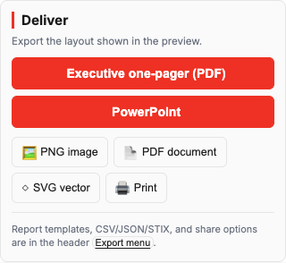

# TimelineForge

**Browser-based IR timeline editor** — turn notes, SIEM exports, and report appendices into executive and SOC-ready visuals.

<p align="center">
  <a href="https://dmalcher-ftnt.github.io/timelineforge/"><strong>Live demo →</strong></a>
</p>

<p align="center">
  
</p>

<p align="center">
  
  &nbsp;
  
</p>

<p align="center">
  <sub>PUBLISH · EDIT — APT breach sample timeline (v1.3.2)</sub>
</p>

## What it does

**INPUT → EDIT → PUBLISH** in the browser. No backend, no account — incident data stays local.

- **Import** manual snippets, markdown tables, PDF/DOCX, and **23 IR tools** (Splunk, Sentinel, KAPE, Hayabusa, EvtxECmd, CrowdStrike, Defender, Elastic, MISP, …)
- **Edit** with host/user/MITRE/tag filters, observables, bulk updates, merge duplicates, data quality recommendations, and baseline compare
- **Publish** pick from **17 IR-oriented layouts** (swimlanes, MITRE heatmap, containment lanes, executive board, report appendix, …), preview live, and export PNG/PDF, executive PDF, report pack (ZIP), PPTX, Word, STIX 2.1, CSV, share links, and offline HTML

**Usability highlights (v1.3.2):** first-run welcome, explicit Import timeline button, dismissible demo banner, persistent status toasts, slim PUBLISH deliver panel (report templates & data formats in header **Export** menu), and quality badge that opens the report without leaving your tab.

Works **offline** after the first visit (installable PWA). Inspired by [MetroViz](https://github.com/rstockm/Metroviz), built for security incidents.

## Quick start

```bash
git clone https://github.com/dmalcher-FTNT/timelineforge.git
cd timelineforge
npm install && npm run vendor   # first time — builds vendor/ (~30 MB, not in git)
python3 -m http.server 8080
```

Open **http://localhost:8080**, then try **File → Samples** (APT breach, ransomware, BEC, and more).

```bash
npm test              # unit + smoke (174 tests)
npm run test:e2e      # Playwright UI tests (37 tests)
npm run test:all      # both suites
npm run build         # deployable site → dist/
npm run release       # build + full test suite
npm run screenshots   # refresh docs/screenshots/ for README
```

Deploy: **[DEPLOY.md](DEPLOY.md)** · Releases: **[CHANGELOG.md](CHANGELOG.md)**

## Contact

David Malcher — [dmalcher@fortinet.com](mailto:dmalcher@fortinet.com)

MIT — [LICENSE](LICENSE)
